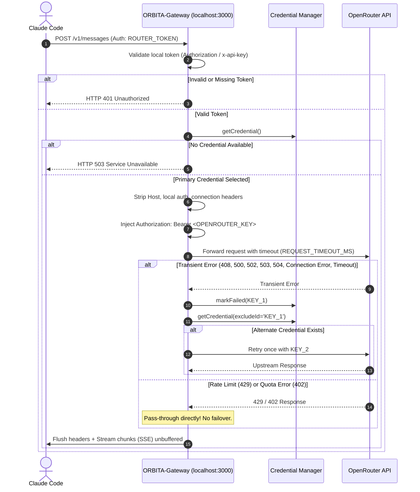

# ORBITA-Gateway Architecture

## 1. High-Level Overview

ORBITA-Gateway is a lightweight, secure local API gateway that bridges Claude Code and OpenRouter. It runs exclusively on `127.0.0.1:3000`, authenticates local requests with a dedicated router token, strips sensitive client headers, injects configured OpenRouter API credentials, and streams responses chunk-by-chunk without buffering.

```
┌──────────────┐
│ Claude Code  │
└──────┬───────┘
       │ HTTP / JSON / SSE
       │ Auth: ROUTER_TOKEN (Bearer or x-api-key)
       ▼
┌────────────────────────────────────────────────────────┐
│ ORBITA-Gateway (127.0.0.1:3000)                        │
│                                                        │
│  ┌────────────────────────┐  ┌──────────────────────┐  │
│  │ Local Auth Guard       │  │ Health Endpoint      │  │
│  │ (Validates local token)│  │ (GET /health)        │  │
│  └───────────┬────────────┘  └──────────────────────┘  │
│              ▼                                         │
│  ┌────────────────────────┐  ┌──────────────────────┐  │
│  │ Header Sanitizer &     │  │ Credential Manager   │  │
│  │ Upstream Formatter     │◄─┤ • In-memory state    │  │
│  └───────────┬────────────┘  │ • Cooldown tracking  │  │
│              ▼               │ • Single failover    │  │
│  ┌────────────────────────┐  └──────────────────────┘  │
│  │ Unbuffered SSE Streamer│                            │
│  └───────────┬────────────┘                            │
└──────────────┼─────────────────────────────────────────┘
               │ HTTPS (OpenRouter API Key)
               ▼
┌──────────────────────────────┐
│       OpenRouter API         │
│ (https://openrouter.ai/api)  │
└──────────────┬───────────────┘
               │
               ▼
┌──────────────────────────────┐
│   NVIDIA Nemotron 3 Ultra    │
└──────────────────────────────┘
```

---

## 2. Request Lifecycle & Routing Flow



---

## 3. Authentication & Header Transformation

### Incoming Client Request
Claude Code sends requests using Anthropic SDK conventions:
* `Host: 127.0.0.1:3000` (or `localhost:3000`)
* `Authorization: Bearer <ROUTER_TOKEN>` OR `x-api-key: <ROUTER_TOKEN>`
* `anthropic-version: 2023-06-01`
* `anthropic-beta: ...`
* `Content-Type: application/json`

### Header Transformation Pipeline
1. **Local Authentication**: Extracted token is compared against `ROUTER_TOKEN`. Mismatch immediately returns HTTP 401.
2. **Header Stripping**: The following headers are removed:
   * `Host` (prevents Cloudflare/OpenRouter host mismatch)
   * `Authorization` (strips local token)
   * `x-api-key` (strips local token)
   * `Connection`, `Keep-Alive`, `Transfer-Encoding`, `Upgrade` (hop-by-hop headers)
   * `Content-Length` (recalculated from buffered request body)
3. **Upstream Header Injection**:
   * `Authorization: Bearer <OPENROUTER_KEY_N>` (injected using active healthy credential)
   * `Content-Length: <byteLength>` (for request bodies)
4. **Header Preservation**:
   * All standard client headers (`content-type`, `anthropic-version`, `anthropic-beta`, etc.) are preserved verbatim.

---

## 4. Streaming Architecture

Coding agents like Claude Code rely heavily on long-running Server-Sent Events (SSE) for interactive output. ORBITA-Gateway implements unbuffered, chunk-by-chunk streaming:

1. **Immediate Header Flush**: As soon as upstream status and headers are received, the gateway calls `res.writeHead(status, headers)` followed by `res.flushHeaders()` to disable socket buffering and Nagle's algorithm delay.
2. **Chunk-by-Chunk Piping**: The incoming `upstreamResponse.body` Web ReadableStream is consumed asynchronously:
   ```javascript
   for await (const chunk of upstreamResponse.body) {
     res.write(chunk);
   }
   res.end();
   ```
3. **Failover Invariant**: Transient failover is strictly evaluated **before** downstream response headers are committed (`res.writeHead`). Once streaming has begun, failover cannot occur, ensuring the downstream client never receives a corrupted or re-started stream.

---

## 5. Credential Health & Failover Lifecycle

The gateway tracks credential health in memory without persisting state to disk.

```
       ┌──────────┐
       │ Healthy  │◄───────────────────────┐
       └────┬─────┘                        │
            │                              │
 Transient  │ Connection, Timeout,         │ Cooldown expires
  Failure   │ 408, 500, 502, 503, 504      │ (KEY_COOLDOWN_MS)
            ▼                              │
       ┌──────────┐                        │
       │ Cooldown ├────────────────────────┘
       └──────────┘
```

### Failover Rules
* **Transient Infrastructure Failures (Failover Enabled)**:
  * Network connection error (`ECONNREFUSED`, `ENOTFOUND`, fetch abort)
  * Request timeout (exceeding `REQUEST_TIMEOUT_MS`)
  * HTTP status codes: `408`, `500`, `502`, `503`, `504`
* **Non-Transient & Policy Errors (Failover Strictly FORBIDDEN)**:
  * HTTP `429` (Rate Limit)
  * HTTP `402` (Payment Required / Out of Credits)
  * Quota exhaustion & account spending limits
  * Client errors: `400`, `401`, `403`, `404`
* **Single Retry Limit**: Maximum **one** alternate credential attempt per request. If both credentials fail, the gateway returns the upstream error directly.

---

## 6. Operational Error Handling Matrix

| Status / Event | Root Cause | Gateway Action | Failover Triggered? | Client Response |
|---|---|---|---|---|
| **200 OK** | Successful request | Stream response to client | No | HTTP 200 (Streamed) |
| **400 Bad Request** | Invalid payload / schema | Pass upstream response through | **No** | HTTP 400 (Upstream body) |
| **401 Unauthorized (Local)** | Missing or invalid `ROUTER_TOKEN` | Reject at gateway guard | **No** | HTTP 401 (`authentication_error`) |
| **401 Unauthorized (Upstream)** | Invalid OpenRouter API key | Pass upstream response through | **No** | HTTP 401 (Upstream body) |
| **402 Payment Required** | Insufficient OpenRouter credits | Pass upstream response through | **No** | HTTP 402 (`insufficient_quota`) |
| **403 Forbidden** | Account limit or model access restriction | Pass upstream response through | **No** | HTTP 403 (`account_limit`) |
| **404 Not Found** | Unknown endpoint path | Pass upstream response through | **No** | HTTP 404 (Upstream body) |
| **408 Request Timeout** | Upstream server timed out | Mark key failed, retry once with alternate | **Yes (1 attempt)** | Upstream response or HTTP 504 |
| **429 Too Many Requests** | Upstream rate limit reached | Pass upstream response through | **No** | HTTP 429 (`rate_limit_error`) |
| **500 Internal Server Error** | Upstream internal failure | Mark key failed, retry once with alternate | **Yes (1 attempt)** | Upstream response or HTTP 500 |
| **502 Bad Gateway** | Upstream gateway / proxy error | Mark key failed, retry once with alternate | **Yes (1 attempt)** | Upstream response or HTTP 502 |
| **503 Service Unavailable** | Upstream capacity / maintenance | Mark key failed, retry once with alternate | **Yes (1 attempt)** | Upstream response or HTTP 503 |
| **504 Gateway Timeout** | Upstream gateway timed out | Mark key failed, retry once with alternate | **Yes (1 attempt)** | Upstream response or HTTP 504 |
| **Connection Failure** | Network disconnected, DNS fail | Mark key failed, retry once with alternate | **Yes (1 attempt)** | HTTP 502 (`upstream_connection_error`) |
| **Request Timeout** | Request exceeded `REQUEST_TIMEOUT_MS` | Mark key failed, retry once with alternate | **Yes (1 attempt)** | HTTP 504 (`timeout_error`) |
| **No Credentials Configured** | `OPENROUTER_KEY_1..20` empty in `.env` | Reject before upstream call | **No** | HTTP 503 (`service_unavailable`) |
| **All Credentials in Cooldown** | All keys temporarily unhealthy | Reject before upstream call | **No** | HTTP 503 (`service_unavailable`) |
